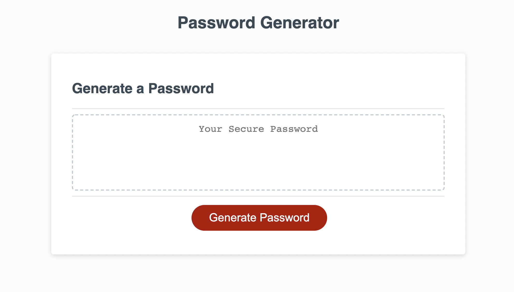
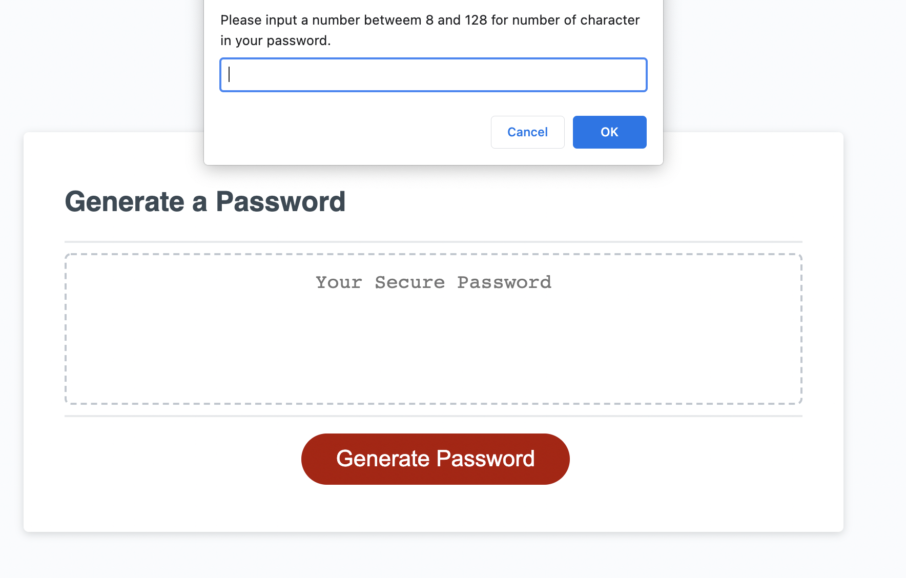
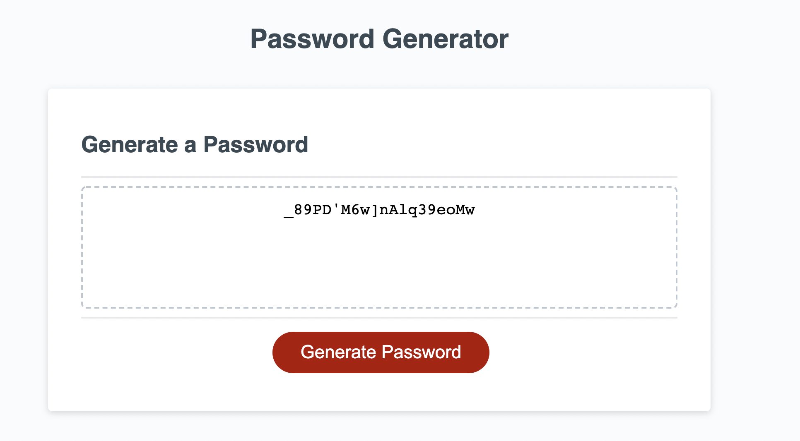

# Password Generator Website

In this project, I wrote JavaScript code to generate a password based on user inputs.  Specifically, the user inputs the length of the desired password and the specific types of characters to be included in the password (i.e. uppercase, lowercase, numerical, or special).  The site then generates a password composed of random characters that conform to the user's constraints.     

## Deployment

My password generator website has been deloyed and can be accessed here: https://greenmanaustin.github.io/password-generator/

Here are screenshots of the live website:

## Skills Learned

I learned to utilize for-loops, while-loops, if-then conditionals, function expressions, switches, and a variety of other JavaScript's built in functions.  I also learned to pseudo-code and persevere until I achieved the desired result.    

